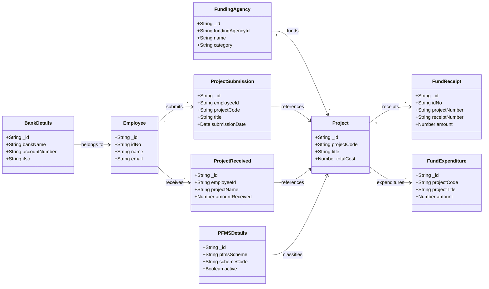

<!-- Logo -->

  

# Domain Model (Overview)

Notes:
- Attributes are illustrative; actual fields are defined in `ProjecrSubmission/Model/*.java`.
- Relationships reflect typical usage inferred from controllers and repositories.
