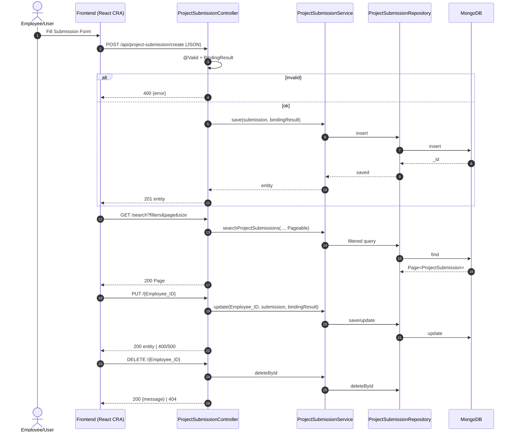
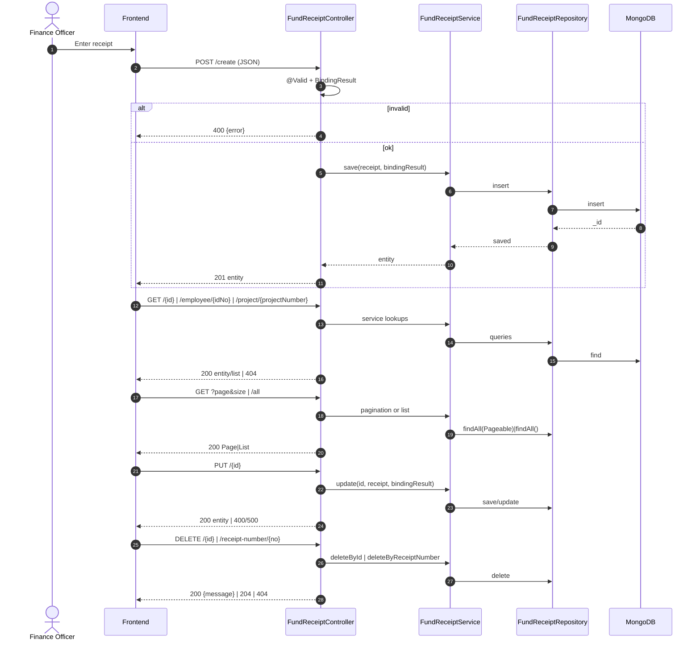
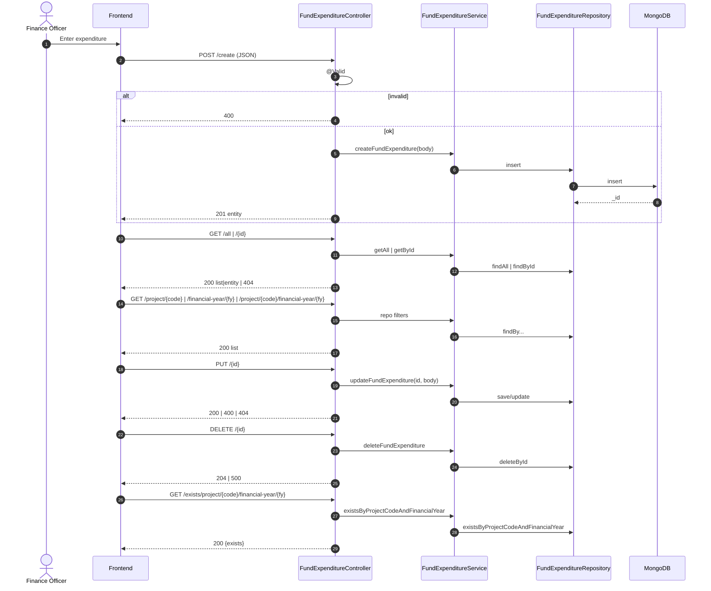
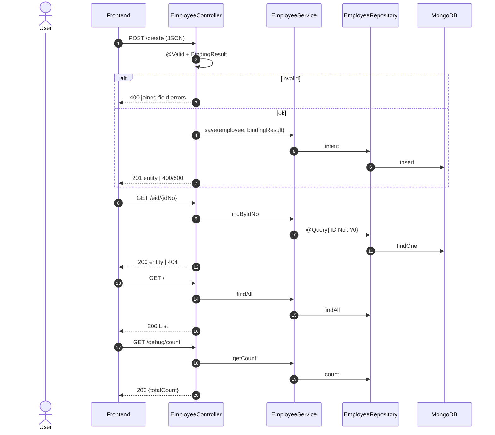
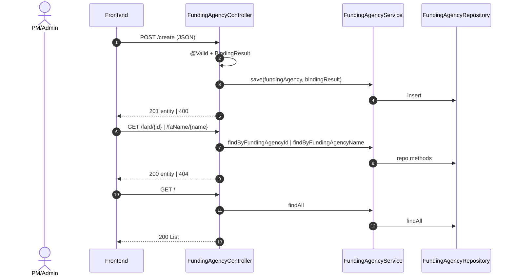
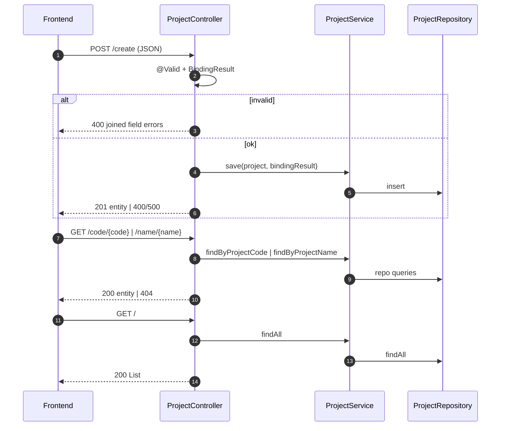
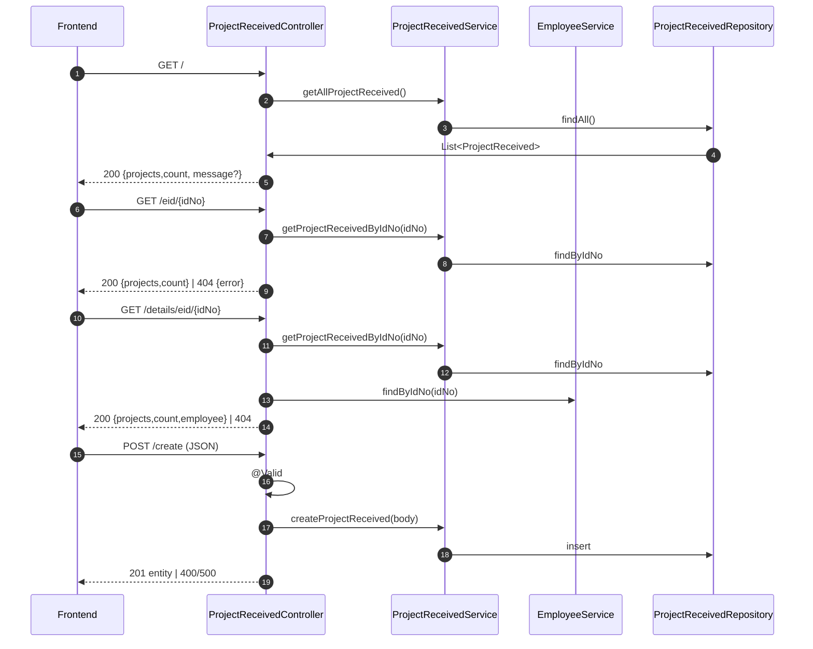
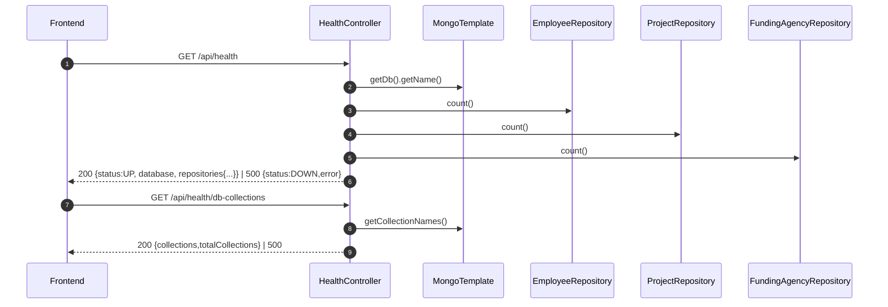

<!-- Logo -->

  

# BHU Project Management System – All Flows (Consolidated)

This document consolidates detailed, code-accurate flow diagrams for all backend controllers.

Contents
- Project Submission
- Fund Receipt
- Fund Expenditure
- Employee
- Funding Agency
- Project
- Project Received
- Health

Notes
- All controllers use CORS for localhost:3000/8080.
- Base package: `dev.deepesh.ProjecrSubmission.Controller`.

---

## Project Submission
Source: `ProjecrSubmission/ProjecrSubmission/src/main/java/dev/deepesh/ProjecrSubmission/Controller/ProjectSubmissionController.java`
Base path: `/api/project-submission`

---

## Fund Receipt
Source: `Controller/FundReceiptController.java`
Base path: `/api/fund-receipt`

---

## Fund Expenditure
Source: `Controller/FundExpenditureController.java`
Base path: `/api/fund-expenditure`

---

## Employee
Source: `Controller/EmployeeController.java`
Base path: `/api/employee`

---

## Funding Agency
Source: `Controller/FundingAgencyController.java`
Base path: `/api/funding-agencies`

---

## Project
Source: `Controller/ProjectController.java`
Base path: `/api/project`

---

## Project Received
Source: `Controller/ProjectReceivedController.java`
Base path: `/api/project-received`

---

## Health
Source: `Controller/HealthController.java`
Base path: `/api/health`

