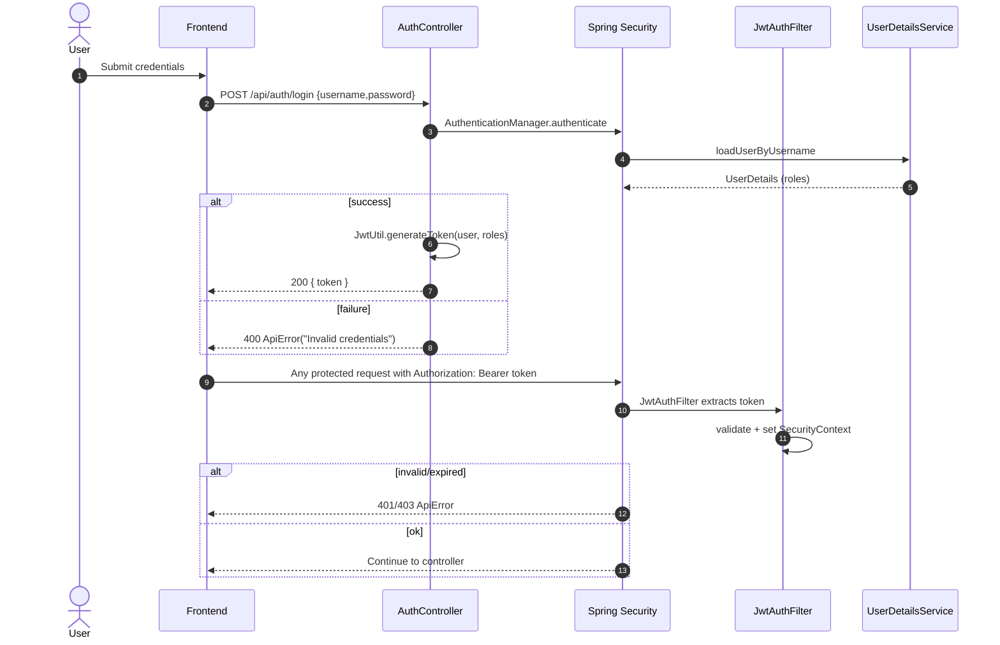

<!-- Logo -->

  

# Security Flow – JWT Auth and RBAC

References
- Config: `.../Security/SecurityConfig.java`
- JWT: `.../Security/jwt/JwtAuthFilter.java`, `.../Security/jwt/JwtUtil.java`
- Users: `.../Security/model/UserAccount.java`, `.../Security/repo/UserAccountRepository.java`
- Auth: `.../Security/controller/AuthController.java`

RBAC
- Mutating endpoints use `@PreAuthorize("hasAnyRole('ADMIN','FORM')")`.
- Deletes use `@PreAuthorize("hasRole('ADMIN')")`.
- All routes except `/api/auth/**`, `/api/health/**`, docs and OPTIONS are authenticated (see `SecurityConfig`).

Headers & Hardening
- HSTS, CSP, Frame-Options, Referrer-Policy, X-Content-Type-Options configured in `SecurityConfig`.
- BCrypt(12) for password hashing.
- JWT secret must be >=256-bit. Fallback derivation via SHA-256 safeguards weak secrets.
