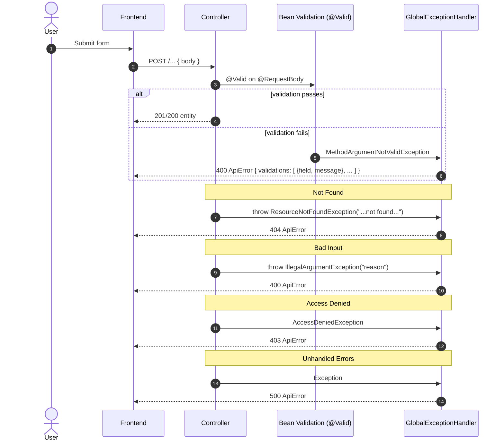

<!-- Logo -->

  

# Validation & Error Handling Flow

References
- Global handler: `.../exception/GlobalExceptionHandler.java`
- Error DTO: `.../exception/ApiError.java`

ApiError Structure
- timestamp: ISO time
- status: HTTP status code
- error: short status text
- message: human-readable message
- path: request URI
- validations: optional array of `{ field, message }` when validation fails
