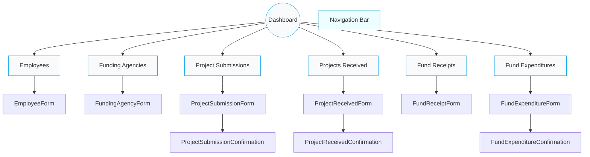

<!-- Logo -->

  

# Frontend Site Map / Navigation

Notes:
- Reflects components under `employee-project-frontend-cra/src/components/` and `src/forms/`.
- Adjust labels to match any exact route names in your `App.tsx`.
