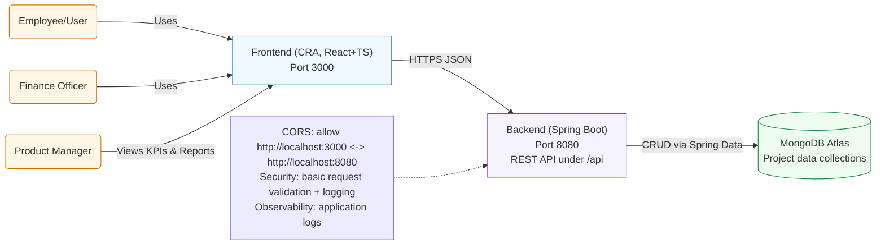

<!-- Logo -->

  

# System Context Diagram

## Notes for PMs
- The frontend communicates with the backend at `http://localhost:8080/api`.
- CORS is enabled for `localhost:3000` and `localhost:8080` in `ProjecrSubmission/CorsConfig.java`.
- MongoDB Atlas stores all core entities (Employees, Projects, Submissions, Receipts, Expenditures, Funding Agencies, PFMS, Bank details).
